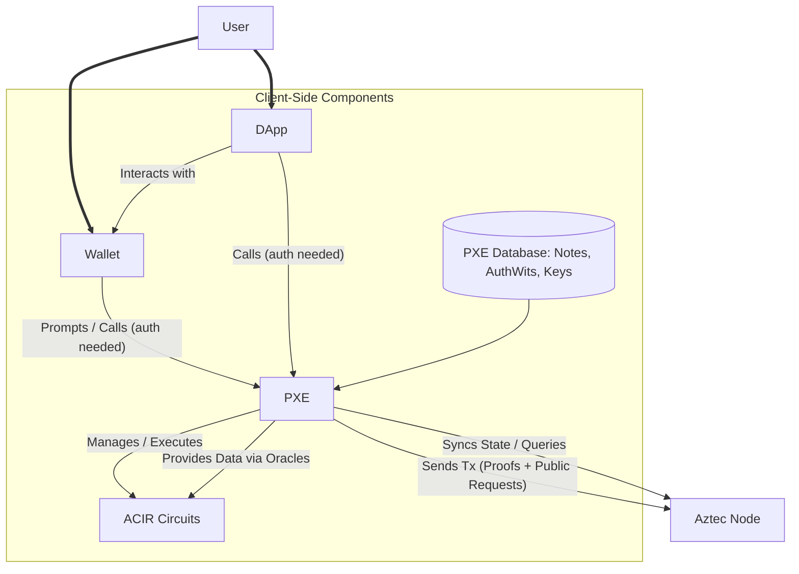

# Private Execution Environment (PXE)

The Private Execution Environment (PXE, pronounced "pixie") is a crucial client-side library in Aztec, enabling the execution of private operations. It's typically a TypeScript library runnable in Node.js, directly within wallet software, or even in a browser.

The PXE's primary role is to generate proofs for private function executions. These proofs, along with any requests for public function execution, are then sent to the sequencer. A key design principle is that **private inputs never leave the client-side PXE**.

## Responsibilities of the PXE

*   **Secret Storage**: Securely stores secrets like encryption keys, private notes, and tagging secrets (used for [note discovery](./../NotesAndUTXOs/NoteDiscovery.md)). It exposes a safe interface for accessing them.
*   **Private Execution & Proof Generation**: Orchestrates the execution of private functions (which are circuits) and the generation of their corresponding ZK-SNARK proofs. This includes implementing oracles needed by the contract circuits during transaction execution.
*   **State Syncing**: Syncs the user's relevant network state (both public and private) by obtaining data from an Aztec node.
*   **Multi-Account Management**: Can handle data and secrets for multiple user accounts while providing necessary isolation and siloed permissions between them.

## System Architecture

The PXE sits at the heart of client-side operations, interacting with various components:

*   **User**: Interacts with DApps and Wallets.
*   **DApp/Wallet**: Initiate actions, request data, and prompt the user. They communicate with the PXE for any operations involving private state or private execution.
*   **PXE**: The core engine for private operations.
*   **ACIR Circuits**: The smart contract logic for private functions, executed/proven within the PXE.
*   **Aztec Node**: The user's gateway to the Aztec network for broadcasting transactions and fetching state.

## Components of the PXE

### 1. Transaction Simulator
*   **Initiation**: An application (DApp or Wallet) prompts the user's PXE to execute a transaction (e.g., execute function X with arguments Y from account Z).
*   **Gas Estimation**: The application or wallet might handle gas estimation prior to simulation.
*   **ACIR Simulator**: This component handles the actual execution simulation of smart contract functions (private, public, and utility). It generates the necessary data (partial witness, public inputs) and collects side effects (new notes, nullifiers, state changes). More details can be found in the [ACIR Simulator](./ACIRSimulator.md) section.
*   **Authwits for Simulation**: Until "simulated simulations" (a feature to predict authwit needs, tracked as #9133) are fully implemented, authentication witnesses (authwits) are generally required *before* simulation if the functions being simulated need them.

### 2. Proof Generation
*   **Process**: After a successful simulation, the wallet calls `proveTx` on the PXE.
*   **Inputs to `proveTx`**: All data generated during simulation (e.g., execution trace, new notes, nullifiers) and any required authentication witnesses (which allow other contracts to act on behalf of the user's account contract).
*   **Output**: A proven transaction (containing ZK proofs for private functions).
*   **Broadcast**: The wallet then sends this proven transaction to the network (via an Aztec Node) and typically returns the transaction hash to the application for tracking.

### 3. Database

The PXE maintains a local database to store transactional data and user-specific private information.

*   **Notes**: Encrypted data representing users' private state. While the encrypted blobs might be on-chain, the PXE stores the decrypted versions for accounts it manages. Contracts often parse on-chain data to find relevant notes, which are then stored in the PXE by the wallet.
*   **Authentication Witnesses (AuthWits)**: Data (often signatures or other proofs) used to approve other entities (contracts, users) to execute transactions on the current user's behalf. The PXE provides these to transactions on-demand during simulation via oracle calls. See [Authentication Witness (Authwit)](./../AccountsAndAuth/AuthWit.md).
*   **Capsules**: External data or data injected into the system via oracles during contract execution.
*   **Address Book**: A list of expected Aztec addresses that the PXE may encrypt notes for, or from whom it might receive encrypted notes. This helps the PXE optimize the note discovery process by reducing the search space.

*Note on Note Discovery*: The PXE itself is *not* directly in charge of the core note discovery logic (i.e., finding all notes owned by the user across the entire chain). This discovery process, often using tagging mechanisms, is typically handled by logic within Aztec contracts (Aztec.nr). The PXE then stores the discovered and decrypted notes. Learn more about [Note Discovery](./../NotesAndUTXOs/NoteDiscovery.md).

### 4. Authorization & Scopes

The PXE manages fine-grained access rights for DApps and other callers. Permissions can be scoped by:
*   **Action**: What can be done (e.g., query notes, simulate a call).
*   **Domain**: The origin of the request (e.g., `uniswap.com`).
*   **Contract**: The specific contract address the action pertains to.
*   **Account**: The specific user account within the PXE the action is for.

**Example**: `uniswap.com` (domain) can `query private notes` (action) on `five specific token contracts` (contracts) for `two of my accounts` (accounts) registered in the PXE.

**Available Actions (Examples)**:
*   Checking if an account exists in the PXE.
*   Running queries, simulations, accessing logs, registering contracts for a given contract address.
*   Manually adding notes to the PXE's database.

**Scope Definition**: When a DApp interacts with the PXE, it can specify scopes:
*   `scopes: []` (empty array): No information can be accessed.
*   `scopes: undefined` (or not provided): Defaults to all available/permissible scopes for that DApp/domain.

### 5. Contract Management
*   Applications can request the user's PXE to add the bytecode (artifact) of contracts required for interaction.
*   The PXE will check if these contracts have already been registered.
*   **Privacy Note**: There are typically no direct getter functions to check if a specific contract has been registered by a DApp, as this could leak information about a user's interaction history (e.g., a malicious DApp could try to fingerprint users by checking for the presence of known DApp contracts in their PXE).

### 6. Keystore
*   A secure storage component within the PXE for managing the user's private and public keys (e.g., encryption keys, nullifier keys, signing keys if used by the account contract).

### 7. Oracles
*   Oracles in Aztec are mechanisms for providing client-side data to smart contract functions during their (private) execution. The PXE implements these oracle interfaces.
*   When a private function in an Aztec.nr contract makes an oracle call (e.g., to get a specific note to spend, or to get an authwit), the PXE intercepts this call and provides the requested data from its database or generates it as needed.
*   You can read more about oracles in the smart contracts section of the main Aztec documentation.

## For Developers

To learn how to develop on top of the PXE, refer to these guides in the official Aztec documentation:
*   Running more than one PXE on your local machine.
*   Using in-built oracles, including oracles for arbitrary data. 