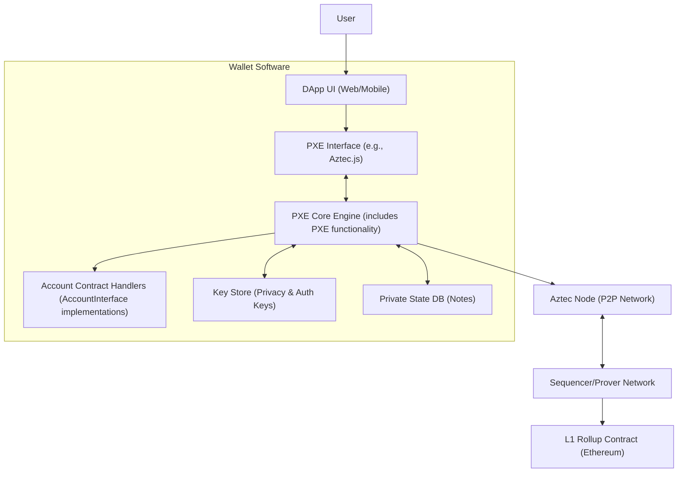

# Wallets: Your Gateway to Aztec

**Analogy**: An Aztec wallet is like a highly advanced personal assistant and a secure briefcase combined. It not only holds your keys and assets but also performs complex computations (proofs) on your behalf.

Wallets in Aztec are user-facing applications that manage accounts and interact with dapps. They have standard responsibilities and some unique to Aztec's private nature.

## Standard Wallet Responsibilities
*   Managing user accounts (creating, browsing).
*   Monitoring balances.
*   Storing seed phrases and private keys (or interfacing with hardware wallets/keystores).
*   Providing an interface for dapps to request actions (e.g., view account state, send transactions).

## Aztec-Specific Wallet Responsibilities
*   **Track Private State**: Maintain a local, encrypted database of all private notes belonging to the user's accounts. This involves scanning blocks and trying to decrypt notes.
*   **Produce Local Proofs**: Generate zero-knowledge proofs for the execution of private functions *locally on the user's device*. This is a major difference from chains where all execution happens on network nodes.

## Account Setup
*   Users deploy an **account contract** to represent their account on-chain. This contract dictates how their transactions are authenticated and executed.
*   Wallets support specific account contract implementations.
*   **Deterministic Addresses**: Wallets can generate a complete Aztec address for a user *before* their account contract is deployed. This allows users to receive funds even if they haven't yet paid gas to deploy their contract.

## Transaction Lifecycle (Simplified)
1.  **Dapp Request**: A dapp requests the wallet to perform an action (e.g., "transfer 5 PrivateETH").
2.  **Execution Request**: The wallet creates an execution request, including instructions for the user's account contract.
3.  **Local Simulation & Proving (Private Part)**:
    *   The wallet simulates the private functions involved in the transaction.
    *   It then generates ZK proofs of correct execution for these private functions. This happens locally.
    *   This step also determines new notes to be created and old notes to be nullified.
4.  **Send to Network**: The wallet sends the transaction (which includes the proofs and public data like nullifiers and new note commitments) to an Aztec Node.
5.  **Sequencing & Settlement**: The node relays it to a Sequencer, who validates proofs, executes any public parts, and includes it in a block that eventually settles on L1.

**Key Point**: The private execution trace (what happens inside private functions) is deterministic because it depends only on the input notes, which are immutable. However, the transaction might be dropped if an input note was already nullified by another transaction. Public function execution depends on the public chain state at the time of inclusion.

## Authorizing Actions
Account contracts can authorize other contracts or users to perform actions.
*   **Private Functions**: Use **auth witnesses**. These are typically signatures over an action's identifier. The wallet generates these via a `createAuthWit` call when requested by an application. (See [Authentication Witness (Authwit)](./../AccountsAndAuth/AuthWit.md) for details).
*   **Public Functions**: Authorizations are often pre-stored in the account contract's public storage.

## Key Management
*   **Privacy Keys**: Mandated by the protocol, used for encryption and nullification. Currently, these need to be available in the wallet software itself.
*   **Authentication Keys**: Dependent on the specific account contract implementation (e.g., ECDSA keys, WebAuthn credentials). These can often be rotated or recovered if the account contract supports it.
(See [Keys](./../Keys/Keys.md) for more details).

## Recipient Encryption Keys
Wallets manage a registry of public encryption keys for known recipients to facilitate sending encrypted notes.

## Private State Synchronization
*   Wallets typically **brute-force decrypt** encrypted data blobs in new blocks using the user's decryption keys. (More advanced methods like [Note Discovery](./../NotesAndUTXOs/NoteDiscovery.md) with tagging are also employed).
*   If a blob decrypts successfully, the note is added to the user's local private state database.
*   This means wallets can reconstruct a user's entire private state from their encryption keys if local data is lost, as long as the encrypted data is on L1.

## Wallet Architecture: Under the Hood

**Core Idea**: An Aztec wallet is essentially an instance of a **Private Execution Environment (PXE)** that also handles user keys and private state. (See [Private Execution Environment (PXE)](./PXE.md) for details).

### Overview
*   **PXE (Private Execution Environment)**: This is the engine that runs locally.
*   **Local Database**: The PXE requires a local database for storing private notes and other relevant data.
*   **Syncing**: Continuously syncs new blocks to trial-decrypt notes.
*   **Account Contract Implementations**: A wallet must be able to handle one or more specific account contract implementations.

### Key Interfaces (from `aztec.js`)
1.  **`AccountInterface`**:
    *   JavaScript/TypeScript counterpart to an on-chain account contract.
    *   Defines how to create execution requests and generate auth witnesses for a specific account contract.
2.  **`PXEInterface`**:
    *   The interface dapps use to interact with the wallet.
    *   Provides functions for account/contract registration, transaction simulation/proving/sending, querying state, etc.

### Diagram: Wallet Architecture High-Level

## Why it Matters for Developers
*   Dapps interact with wallets, not directly with the low-level protocol for many operations.
*   Understanding the wallet's role in local proof generation and private state management is crucial for dapp UX.
*   The `createAuthWit` mechanism is important for dapps that need to perform actions on behalf of users.
*   Wallets choose which account contract implementations they support, influencing user options for authentication and recovery. 